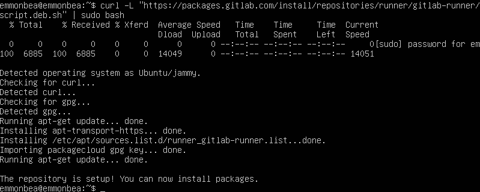
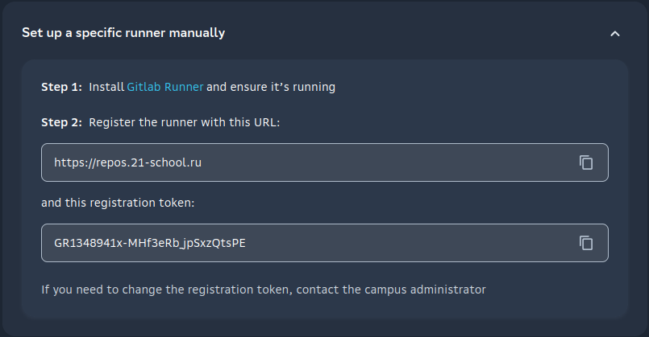
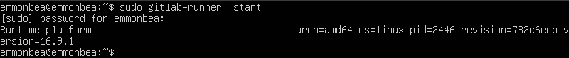
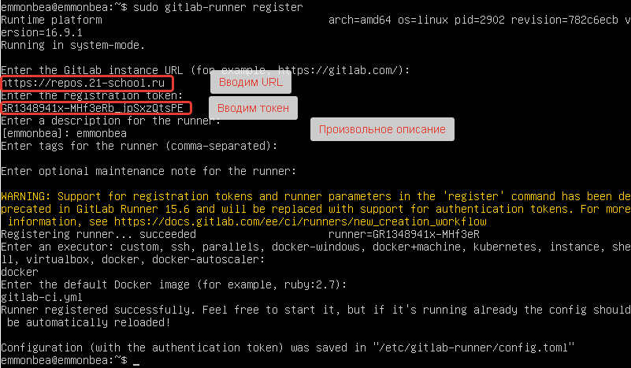

# Basic CI/CD

## Содержание

1. [Part 1. Настройка gitlab-runner](#part-1-настройка-gitlab-runner)
2. [Part 2. Сборка](#part-1-настройка-gitlab-runner)
3. [Part 3. Тест кодстайла](#part-1-настройка-gitlab-runner)
4. [Part 4. Интеграционные тесты](#part-1-настройка-gitlab-runner)
5. [Part 5. Этап деплоя](#part-1-настройка-gitlab-runner)
6. [Part 6. Дополнительно. Уведомления](#part-1-настройка-gitlab-runner)

## Part 1. Настройка gitlab-runner

1. Поднять виртуальную машину `Ubuntu Server 22.04 LTS`:

    

2. Скачать и установить на виртуальную машину `gitlab-runner`:

    ``` bash
    curl -L "https://packages.gitlab.com/install/repositories/runner/gitlab-runner/script.deb.sh" | sudo bash
    ```

    

    ``` bash
    sudo apt-get install gitlab-runner
    ```

    

3. Запустить `gitlab-runner` и зарегистрировать его для использования в текущем проекте (`DO6_CICD`).

    >Для корретной работы Runner его необходимо связать с текущим проектом.

    * Для регистрации раннера необходимы `URL` и `токен`. Их можно взять со страницы Task на платформе:

        

    * Запустить `gitlab-runner`:

        ``` bash
        sudo gitlab-runner start
        ```

        

    * Зарегистрировать текущий проект:

        ``` bash
        sudo gitlab-runner register
        ```

        


    


[Содержание](#содержание)

## Part 2. Сборка

[Содержание](#содержание)

## Part 3. Тест кодстайла

[Содержание](#содержание)

## Part 4. Интеграционные тесты

[Содержание](#содержание)

## Part 5. Этап деплоя

[Содержание](#содержание)

## Part 6. Дополнительно. Уведомления

[Содержание](#содержание)
