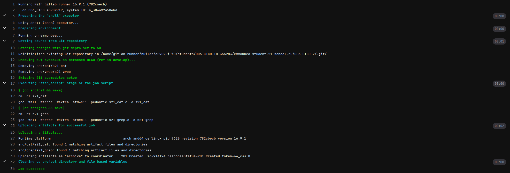
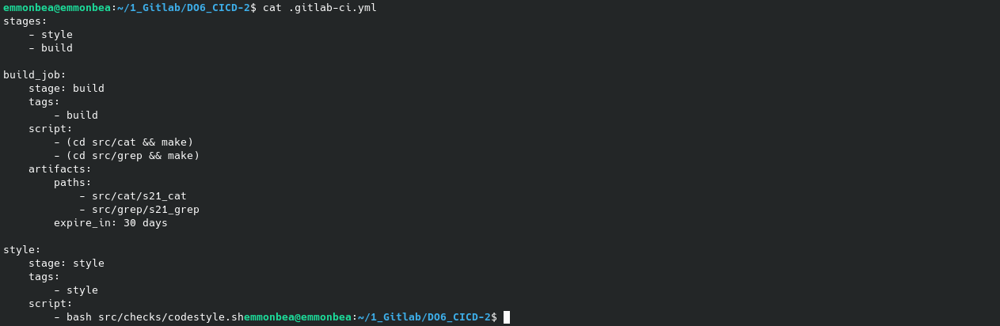

# PROJECT NAME

## Содержание

1. [Part 1. Настройка gitlab-runner](#part-1-настройка-gitlab-runner)
    1. [Скачать  gitlab-runner](#зарегистрировать-gitlab-runner)
    2. [Скачать и установить gitlab-runner](#скачать-и-установить-gitlab-runner)
2. [Part 2. Сборка](#part-2-сборка)
    1. [Напиcать этап для CI по сборке приложений из проекта SimpleBashUtils](#напиcать-этап-для-ci-по-сборке-приложений-из-проекта-simplebashutils)
3. [Part 3. Тест кодстайла](#part-3-тест-кодстайла)
    1. [Написать этап для CI, который запускает скрипт кодстайла (clang-format)](#написать-этап-для-ci-который-запускает-скрипт-кодстайла-clang-format)
4. [Part 4. Интеграционные тесты](#part-4-интеграционные-тесты)
    1. [Написать этап для CI, который запускает интеграционные тесты](#написать-этап-для-ci-который-запускает-интеграционные-тесты)
5. [Part 5. Этап деплоя](#part-5-этап-деплоя)
    1. [Написать этап для CD, который «разворачивает» проект на другой виртуальной машине](#написать-этап-для-cd-который-«разворачивает»-проект-на-другой-виртуальной-машине)
6. [Part 6. Дополнительно. Уведомления](#part-6-дополнительно-уведомления)
    1. [Настроить уведомления о выполнении пайплайна через бота в Telegram](#настроить-уведомления-о-выполнении-пайплайна-через-бота-в-telegram)

## Part 1. Настройка gitlab-runner

### Скачать и установить gitlab-runner

[Руководство по установке](https://docs.gitlab.com/runner/install/linux-manually.html)

1. Скачать бинарный файл:

    ```sh
    sudo curl -L --output /usr/local/bin/gitlab-runner "https://s3.dualstack.us-east-1.amazonaws.com/gitlab-runner-downloads/latest/binaries/gitlab-runner-linux-amd64"
    ```

2. Дать файлу права на исполнение:

    ```sh
    sudo chmod +x /usr/local/bin/gitlab-runner
    ```

3. Создать пользователя Gitlab CI:

    ```sh
    sudo useradd --comment 'GitLab Runner' --create-home gitlab-runner --shell /bin/bash
    ```

4. Установить и запустить как службу:

    ```sh
    sudo gitlab-runner install --user=gitlab-runner --working-directory=/home/gitlab-runner
    sudo gitlab-runner start
    ```
   
      

### Зарегистрировать gitlab-runner

1. Скопировать URL и токен со страницы задания на платформе:

       

2. Зарегистрировать gitlab-runner на текущем проекте:

    ```sh
    sudo gitlab-runner register
    ```

    Далее необходимо заполнить поля регистрации:
    
    - Ввести URL-адрес GitLab;

    - Ввести токен;

    - Ввести имя раннера;

    - Ввести теги;

    - -- ;

    - Ввести тип исполнителя;

       

[Содержание](#содержание)

## Part 2. Сборка

### Напиcать этап для CI по сборке приложений из проекта SimpleBashUtils

1. Создать в корне проекта файл `.gitlab-ci.yml`;

2. В файле gitlab-ci.yml добавить этап запуска сборки через мейк файл из проекта C2;

3. Файлы, полученные после сборки (артефакты), сохранять в произвольную директорию со сроком хранения 30 дней;

     

> Если возникла ошибка: ERROR: Job failed: prepare environment: exit status 1, то необходимо проверить `/home/gitlab-runner/.bash_logout` и закомментировать строку:

    ```sh
    if [ "$SHLVL" = 1 ]; then
        [ -x /usr/bin/clear_console ] && /usr/bin/clear_console -q
    fi
    ```

   

 

[Содержание](#содержание)

## Part 3. Тест кодстайла

### Написать этап для CI, который запускает скрипт кодстайла (clang-format)

1. Написать скрипт, который будет возвращать код ошибки 1 в случае, если clang-format вернет предупреждение:

    
    
2. Обновить `.gitlab-ci.yml`:

    

3. Проверить, что pipeline зафейлится, если код стайл не будет успешно пройден:

    

     

     

4. Исправить стиль, и проверить, что pipeline завершится без ошибок:

     

     

[Содержание](#содержание)

## Part 4. Интеграционные тесты

### Написать этап для CI, который запускает интеграционные тесты

1. Написать скрипт, который будет возвращать код ошибки 1 в случае, если хоть один тест завалится:

    

2. Обновить `.gitlab-ci.yml`:

    

3. Проверить, что все тесты пройдены успешно:

    

[Содержание](#содержание)

## Part 5. Этап деплоя

### Написать этап для CD, который «разворачивает» проект на другой виртуальной машине

1. Поднять вторую виртуальную машину;

2. Настроить статическую маршрутизацию между машинами:

    

    

3. Выполнить на машинах команду:

    ```sh
    sudo netplan apply
    ```

4. Проверить соединение между машинами:

    

    

5. Написать bash-скрипт, который при помощи ssh и scp копирует файлы, полученные после сборки (артефакты), в директорию /usr/local/bin второй виртуальной машины.

    

6. Обновить `.gitlab-ci.yml`:

    

7. Необходимо настроить беспарольную передачу файлов на удаленный сервер;

8. Проверка, что все передалось:

    

    

    

[Содержание](#содержание)

## Part 6. Дополнительно. Уведомления

### Настроить уведомления о выполнении пайплайна через бота в Telegram


[Содержание](#содержание)
